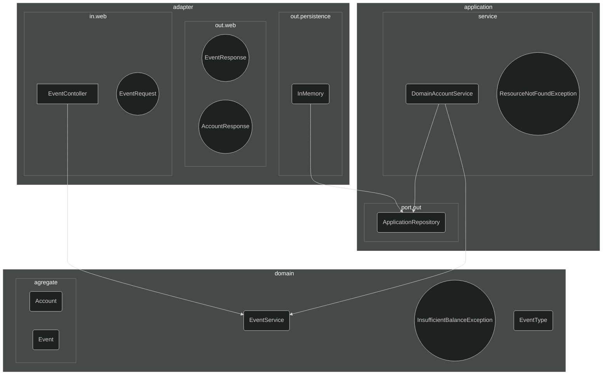

# Getting Started

### Reference Documentation

O desenvolvimento desta soluçao foi baseado em alguns principios de arquitetura hexagonal.
Para nao aumentar a complexidade da soluçao, foi criada estrutura unica de eventos, 
e alguns agregadores para logica mais complexada:

`1` - Adapter
- in : Adaptador Web HTTP : Request/Response (Spring RestController)
  - Objetos de suporte / serializacao / Conversores em Objetos de Dominio
  - Chama o Use Case (application.service)
  - Adapters para conversao entre objetos web/dominio 
- out : 
  - Implementacao da persistencia (em memoria)
  - Objetos web de HTTP Response (Serialization)

`2` - Application
- port:
  - out: Port para conneccao com Adapters de saida (database)
- service:
  - Implementacao da classe de servico e realizacao do Use Case (DomainEventService)

`3` - Domain 
   - Classes de Dominio da logica da aplicacao, regras de negocio
   - aggregate
     - Classes contendo agregacao de objetos complexos e criacao de objetos orientados `a DDD

O diagrama abaixo representa em nivel macro a composicao de pacotes. 
Para nao ficar dificil o entendimento, alguns relacionamentos foram suprimidos



## Notes 

Diferenças de formataçao no teste resultou em falso negativo, 
como comprovado abaixo.
Tentei resolver com algumas configuraçoes, com prettify json.

```
❌ Create account with initial balance
POST /event {"type":"deposit", "destination":"100", "amount":10}
Expected: 201 {"destination": {"id":"100", "balance":10}}
Got:      201 {"destination":{"id":100,"balance":10}}

```

Somente nao atendi a formataçao response body quando ocorre exceçao.
Tentei algumas abordagens menos impactantes, como pode ser visto no application.properties
Utilizei o ResponseStatusException. Sera necessario utilizar outro Exception Handler para atender.

Segue o esperado, e o resultado obtido:

````

❌ Withdraw from non-existing account
POST /event {"type":"withdraw", "origin":"200", "amount":10}
Expected: 404 0
Got:      404 {"timestamp":"2022-05-02T14:39:50.219+00:00","status":404,"error":"Not Found","path":"/event"}


```

