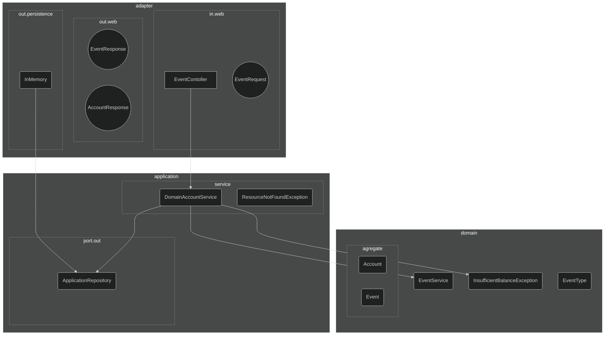

# Getting Started

### Reference Documentation

O desenvolvimento desta soluçao foi baseado em principios de arquitetura hexagonal.
Para nao aumentar a complexidade da soluçao, foi dividia a estrutura do projeto nas layers, a saber:

`1` - Adapter
- in : Adaptador Web HTTP : Request/Response (Spring RestController)
  - Objetos de suporte / serializacao / Conversores em Objetos de Dominio
  - Chama o Use Case (application.service)
  - Adapters para conversao entre objetos web/dominio 

`2` - Application
- port:
  - in: Port para conneccao dos Adapter e utilizacao na Service Layer
- service:  

`3` -  Domain

