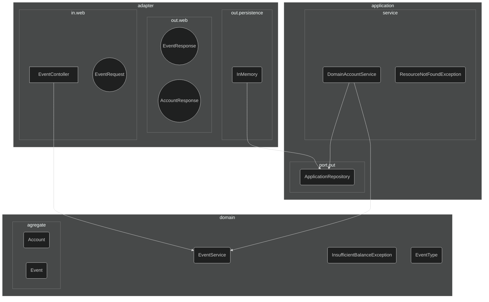

# Getting Started

### Reference Documentation

O desenvolvimento desta soluçao foi baseado em alguns principios de arquitetura hexagonal.
Para nao aumentar a complexidade da soluçao, foi criada estrutura unica de eventos, 
e alguns agregadores para logica mais complexada:

`1` - Adapter
- in : Adaptador Web HTTP : Request/Response (Spring RestController)
  - Objetos de suporte / serializacao / Conversores em Objetos de Dominio
  - Chama o Use Case (application.service)
  - Adapters para conversao entre objetos web/dominio 
- out : 
  - Implementacao da persistencia (em memoria)
  - Objetos web de HTTP Response (Serialization)

`2` - Application
- port:
  - out: Port para conneccao com Adapters de saida (database)
- service:
  - Implementacao da classe de servico e realizacao do Use Case (DomainEventService)

`3` - Domain 
   - Classes de Dominio da logica da aplicacao, regras de negocio
   - aggregate
     - Classes contendo agregacao de objetos complexos e criacao de objetos orientados `a DDD

O diagrama abaixo representa em nivel macro a composicao de pacotes. 
Para nao ficar dificil o entendimento, alguns relacionamentos foram suprimidos

